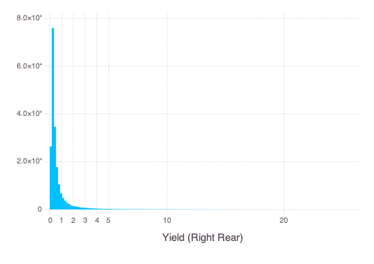
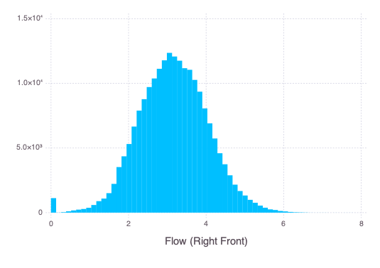

## Dairy Cow Data Code Book
A dictionary of variable names and their definition

### Cow Informaton
`id` (*Int*): Unique cow ID number

`groupid` (*Int*): Unique group ID

`lactnum` (*Int*): Lactation number

### Time
`dinmilk` (*Int*): Days in milk

`date` (*Date*): Date of the milking

`tbegin` (*Time*): Time when the milking began

`tend` (*Time*): Time when the milking ended

`milkdur` (*Time*): Milking duration

`mdurS` (*Int*): Milking duration in seconds

`mdurM` (*Int*): Milking duration in minutes

`interval` (*Float*): Time interval between the end time of the last milking and the begin time of the current milking

`lastmilkint` (*Float*): Time interval between the begin time of the last milking and the begin time of the current milking

### Conductivity
`condlf`, `condlr`, `condrf`, `condrr` (*Float*): Raw conductivity for each teat
|Left Front|Left Rear|
|:---:|:---:|
|||

|Right Front|Right Rear|
|:---:|:---:|
|||

`condtot` (*Float*): Total conductivity

### Yield
`yieldlf`, `yieldlr`, `yieldrf`, `yieldrr` (*Float*): Raw yield value for each teat
|Left Front|Left Rear|
|:---:|:---:|
|||

|Right Front|Right Rear|
|:---:|:---:|
|||

`ypmlf`, `ypmlr`, `ypmrf`, `ypmrr` (*Float*): Yield per minute for each teat. Engineered by dividing the raw yield by the milking duration.
|Left Front|Left Rear|
|:---:|:---:|
|||

|Right Front|Right Rear|
|:---:|:---:|
|||

### Flow
`flowlf`, `flowlf`, `flowrr`, `flowrf` (*Float*): Average flow during the milking. **Note**: This value is different from the yield per min. 
|Left Front|Left Rear|
|:---:|:---:|
|||

|Right Front|Right Rear|
|:---:|:---:|
|||

`peaklf`, `peaklr`, `peakrf`, `peakrr` (*Float*): Peak flow during the milking
|Left Front|Left Rear|
|:---:|:---:|
|||

|Right Front|Right Rear|
|:---:|:---:|
|||

### Blood
`bloodrf`, `bloodrr`, `bloodlf`, `bloodlr` (*Float*): Amount of blood detected in the milk
|Left Front|Left Rear|
|:---:|:---:|
|||

|Right Front|Right Rear|
|:---:|:---:|
|||

`bloodtot` (*Float*): Total amount of blood detected in milk from the 4 teats

### Others
`mdi` (*Float*): Mastitis Detection index (MDi) from the DeLaval milking robot

`teats_not_found`: Indicator for missing teats

`kicklf`, `kicklr`, `kickrf`, `kickrr`: Kickoff indicators

`spr`: Smart pulsation ratio

`incomplete`: Indicator for incompelete records